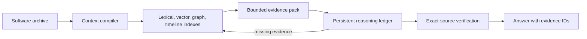

# ForgeMind

ForgeMind is an evidence-first context compiler that indexes a million-token information space and lets Qwen3-4B investigate it on an RTX 3060 through source-verified evidence packs capped at 16,384 active tokens; it does not directly attend to one million tokens.

## 90-second offline demo

Requirements: Windows or Linux, Python 3.11, [`uv`](https://docs.astral.sh/uv/), a local [`llama-server`](https://github.com/ggml-org/llama.cpp), and the Qwen3-4B GGUF described below.

```powershell
uv sync --extra dev
$env:FORGEMIND_LLAMA_SERVER = "C:\path\to\llama-server.exe"
$env:FORGEMIND_MODEL = "C:\path\to\Qwen3-4B-Q4_K_M.gguf"
$env:HF_HUB_OFFLINE = "1"

uv run forgemind ingest examples/showcase-repository --db artifacts/showcase.sqlite
uv run forgemind ask "Why did sessions fail after the April migration?" --db artifacts/showcase.sqlite --mode investigate
```

The first embedding-model setup must be completed before going offline. Once the model assets are cached, the demo requires no cloud credentials. The synthetic showcase contains SQL, TypeScript, and log evidence and executes no imported repository code.

## Architecture



TokenForge reversibly replaces repeated paths and identifiers before model input. The retriever fuses independent channels, the ledger requests missing evidence across bounded cycles, and the verifier rejects claims whose cited source hash or line span no longer matches the archive.

## Tested system

The July 14, 2026 gate used:

- NVIDIA GeForce RTX 3060, 12,288 MiB VRAM; driver 610.74;
- 32,581 MiB system RAM;
- Python 3.11 on Windows;
- [Qwen3-4B GGUF](https://huggingface.co/Qwen/Qwen3-4B-GGUF) Q4_K_M;
- [llama.cpp b9994](https://github.com/ggml-org/llama.cpp/releases/tag/b9994), commit `14d3ba4`;
- [BAAI/bge-small-en-v1.5](https://huggingface.co/BAAI/bge-small-en-v1.5), revision `5c38ec7c405ec4b44b94cc5a9bb96e735b38267a`, on CPU;
- a 16,384-token hard active-context limit and 2,048-token output limit.

The controlled two-case, four-system smoke run stayed at 302 active tokens and 6,278–6,295 MiB sampled VRAM. Those figures validate the local path; they are not a general performance claim.

## Offline assets and checksums

Obtain the tested model under its own terms:

```powershell
hf download Qwen/Qwen3-4B-GGUF Qwen3-4B-Q4_K_M.gguf --local-dir models
Get-FileHash models\Qwen3-4B-Q4_K_M.gguf -Algorithm SHA256
```

Expected SHA-256:

```text
7485fe6f11af29433bc51cab58009521f205840f5b4ae3a32fa7f92e8534fdf5
```

Download the matching CUDA or CPU archive from the pinned llama.cpp b9994 release. The tested `llama-server.exe` SHA-256 is:

```text
3c31f53feeff4d43dbb62b307023a44946074948cf925034d120089c95e20b8c
```

Keep weights and executables outside Git. Task-specific asset manifests and the offline checksum verifier are part of the release tooling, not embedded assets.

## Ingest and investigate

```powershell
uv run forgemind ingest C:\path\to\repository --db artifacts\project.sqlite
uv run forgemind search "session UUID decoder" --db artifacts\project.sqlite
uv run forgemind ask "What caused authentication failures?" --db artifacts\project.sqlite --mode investigate --json
uv run forgemind web --db artifacts\project.sqlite --port 8000
```

The web interface binds to `127.0.0.1`. ForgeMind reads supported source and text files as data; it does not build or execute the imported project.

## Frozen comparison smoke

This July 14 engineering smoke contains only two synthetic cases, including one answer-absent case. Its confidence intervals are intentionally shown to prevent over-interpreting the point estimates.

| System | Factual F1 (95% CI) | Evidence recall (95% CI) | Citation precision (95% CI) |
|---|---:|---:|---:|
| ForgeMind | 0.250 [0.000, 0.500] | 0.500 [0.000, 1.000] | 1.000 [1.000, 1.000] |
| Hybrid retrieval | 0.200 [0.000, 0.400] | 0.500 [0.000, 1.000] | 1.000 [1.000, 1.000] |
| Raw archive | 0.222 [0.000, 0.444] | 0.500 [0.000, 1.000] | 1.000 [1.000, 1.000] |
| Vector-only | 0.333 [0.000, 0.667] | 0.500 [0.000, 1.000] | 1.000 [1.000, 1.000] |

All eight runs completed without runtime errors and abstained correctly on the unsupported question. No ranking claim is justified by this sample. A larger frozen ForgeBench run is required for the technical paper.

## ForgeBench proof program

The staged ForgeBench program compares the same Qwen3-4B model across raw, vector, hybrid, and ForgeMind context strategies. Its runtime manifest contains questions and archive pointers only; answers and exact evidence remain in a separate gold manifest that the evaluation command cannot accept. See [benchmarks/README.md](benchmarks/README.md) for pinned source revisions, the 32-case development workflow, the 160-case final matrix, metrics, success gates, and exact reproduction commands.

RepoQA, LongMemEval, and RULER inputs are derived benchmark slices rather than official leaderboard submissions. ForgeMind's intended claim remains bounded: it organizes and rehydrates evidence from a million-token information space; it does not directly attend to one million tokens.

## Limitations

- ForgeMind supports a million-token information space through indexing and evidence rehydration; it does not directly attend to one million tokens.
- The 4.07-million-token scale gate measured ingestion, reversible compression, refresh behavior, and bounded retrieval—not million-token end-to-end question accuracy.
- The public comparison above is a smoke test, not a statistically persuasive benchmark.
- Citation verification proves that a cited span exists unchanged; it cannot prove that the model interpreted the span correctly.
- Peak VRAM is sampled before and after each local request. Very short transient peaks may be missed.
- The August build uses structured evidence packs rather than learned latent Context Capsules. Adapter training and 7B–14B comparisons are later stages.
- The runtime supports a focused set of file types and has not been hardened as a sandbox for hostile model files.

## Reproduce the gates

Model-free checks:

```powershell
uv sync --extra dev
uv run pytest -q
uv run ruff check .
uv run mypy src
uv run forgemind smoke --runs 10 --offline
```

Generate and profile the ignored large archive:

```powershell
uv run python benchmarks/generate_archive.py --root data/private/forgebench-1m-v2 --target-words 1000000 --seed 42
uv run forgemind profile-scale data/private/forgebench-1m-v2 --db artifacts/forgebench-1m-v2.sqlite --max-active-tokens 16384
```

The verified generated archive contained 1,000,921 words, 4,066,847 Qwen tokens, and 1,155 chunks. Cold ingestion took 100.1 seconds; an equivalent one-file refresh took 1.04 seconds. TokenForge saved a median 14.20% of tokens across eligible passages with exact restoration.

## Safety and privacy

- Runtime hosts are restricted to `127.0.0.1`, `localhost`, or `::1`.
- Imported projects are parsed as untrusted data and are never executed by ForgeMind.
- Answers are constrained to retrieved evidence and unsupported claims are removed or cause abstention.
- Models, private corpora, indexes, benchmark records, plans, papers, reports, and secrets are excluded by `.gitignore`.
- Set `HF_HUB_OFFLINE=1` after preloading the embedding model to prohibit Hub access during a demo.
- No API key is required for the local path. Do not commit `.env` files.

## License and citation

ForgeMind source is MIT licensed. Models, binaries, parsers, and benchmark datasets retain their own licenses; see [THIRD_PARTY_NOTICES.md](THIRD_PARTY_NOTICES.md) before downloading or redistributing them.

If ForgeMind supports your work, cite the repository revision and record the model, llama.cpp build, asset hashes, archive seed, and evaluation manifest used for the result.
